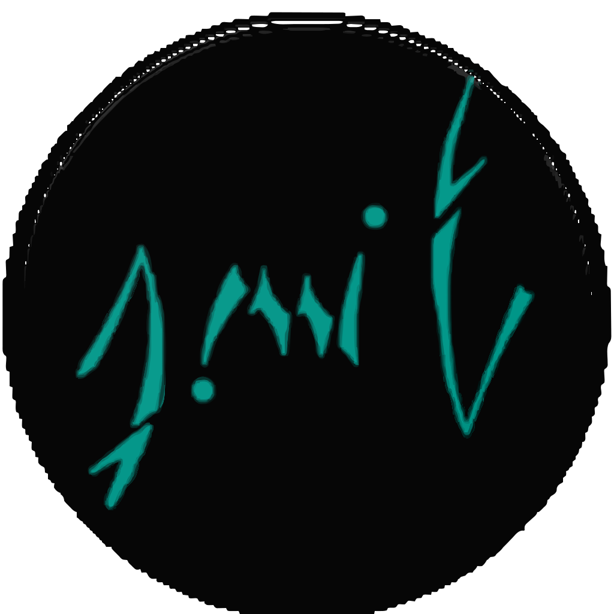

<p align="center">
  <a href="https://github.com/Amit091" target="blank"></a>
</p>

## NestJS GraphQL Image Upload Example

<p align="center">
<a href="https://nodejs.org/" target="_blank"></a>
<a href="https://pnpm.io/" target="_blank"></a>
<a href="https://nestjs.com/" target="_blank"></a>
</p>

## Description

This repository demonstrates how to set up a NestJS application with GraphQL and image upload functionality. It provides a complete example of how to integrate file uploads into a GraphQL API using NestJS and `graphql-upload`.

## Features

- NestJS with TypeScript
- GraphQL API
- Image upload functionality

## Prerequisites

Before you begin, ensure you have the following installed:

- [Node.js](https://nodejs.org/) (v18 or later)
- [pnpm](https://pnpm.io/) (v9 or older)

**Clone the repository:**

```zsh
git clone git@github.com:Amit091/nestjs-graphql-image-upload.git
cd nestjs-graphql-image-upload
```

## Project setup

```zsh
pnpm install
```

## Setup and run the project

1. Start the development server

```zsh
# watch mode
pnpm start:dev
```

2. Access the GraphQL Playground:
   Open your browser and navigate to http://localhost:3000/graphql to interact with the GraphQL API.

3. Upload an image:
   for uplaoding iamge the graphql, i am using postman.

   1. create a request api
   2. enter the graphql url [Graphql Playgound](http://localhost:3000/graphql)
   3. Add `apollo-require-preflight:true` in request header
   4. select the request method as POST
   5. select form-data in body tab
   6. add a key named file and select the image you want to upload

      1. for single file,

      ```json
        operations:{ "query": "mutation UploadFile($file: FileUpload) { uploadFile(uploadFile: $file)}","variables": { "file": null }}
        map:{"a": ["variables.file"]}
      ```

      2. for multiple files,

      ```json
        operations:{ "query": "mutation UploadFiles($files: [FileUpload]) { uploadFiles(uploadFiles: $files)}","variables": { "files": [null,null,null] }}
        map:{"a": ["variables.files.0"],"b": ["variables.files.1"],"c": ["variables.files.2"]}
      ```

   7. Hit send button
   8. you will get the response with the uploaded url as response.

## Run tests

```zsh
# unit tests
pnpm test
```

## References
The implementation of this project can be found in [React GraphQL Image Upload project](https://github.com/Amit091/reactjs-graphql-image-upload.git).

## Stay in touch

- Author - [Amit Dhoju](https://www.facebook.com/amitmaxdhoju)
- [Linkedin](https://www.linkedin.com/in/amitdhoju/)
